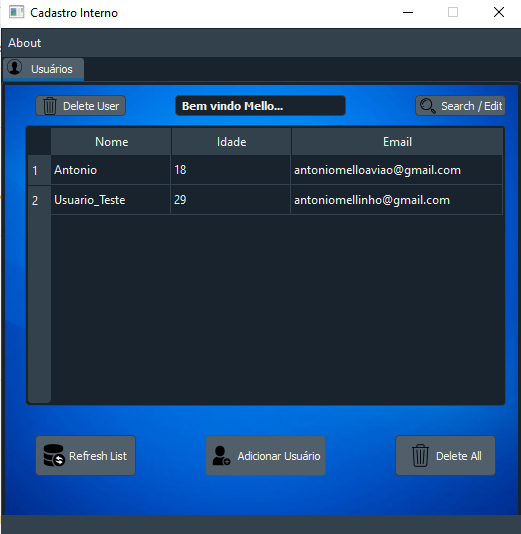
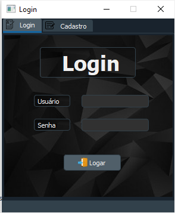
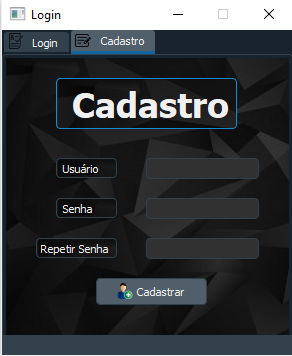

# Simple CRUD in Sqlite - Python

Pequeno Projeto de interface gráfica que permite adicionar,remover,alterar e visualizar usuários e informações dentro de um
banco de dados

### Prerequisites

Bibliotecas necessárias para rodar:
* Pyqt5 
* validate_email
* Pyqt5-widgets

 ```pip install Pyqt5```  
```pip install validate_email```  
```pip install Pyqt5-widgets```  


### Design of the GUI


  



## Built With

* [PyQt5](https://doc.bccnsoft.com/docs/PyQt5/) - The python framework used


## Authors

* **Antonio Mello** * - [Mello](https://github.com/MelloTonio)

